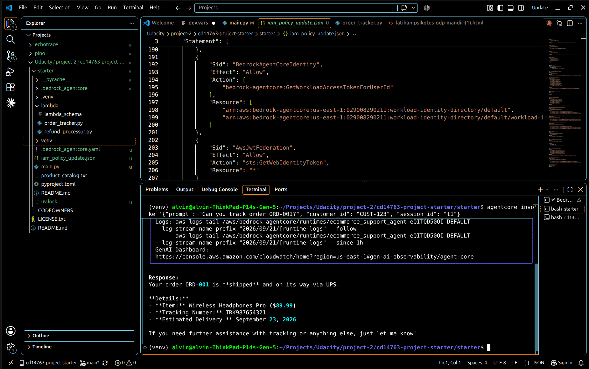
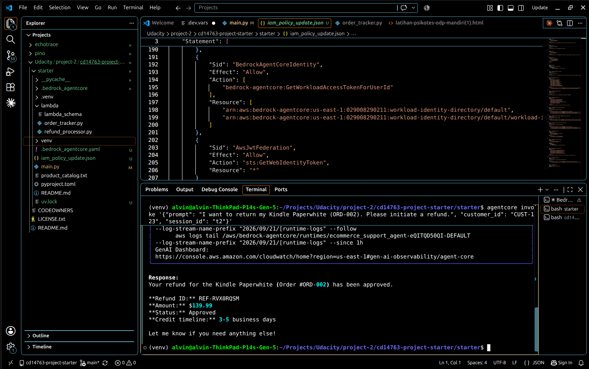
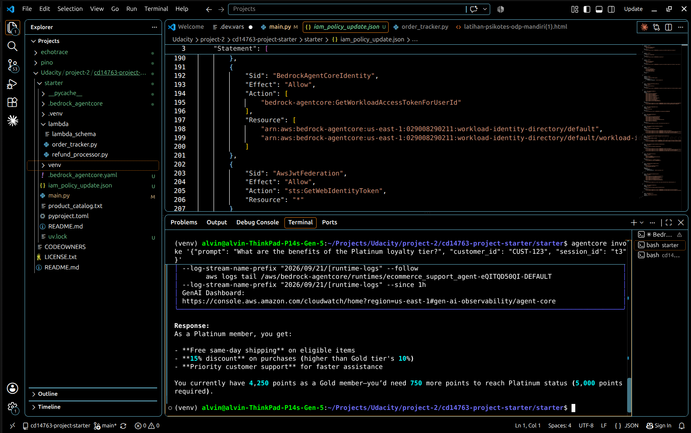
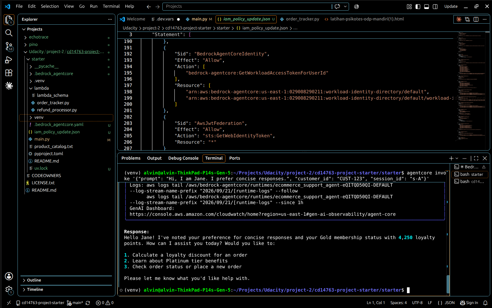
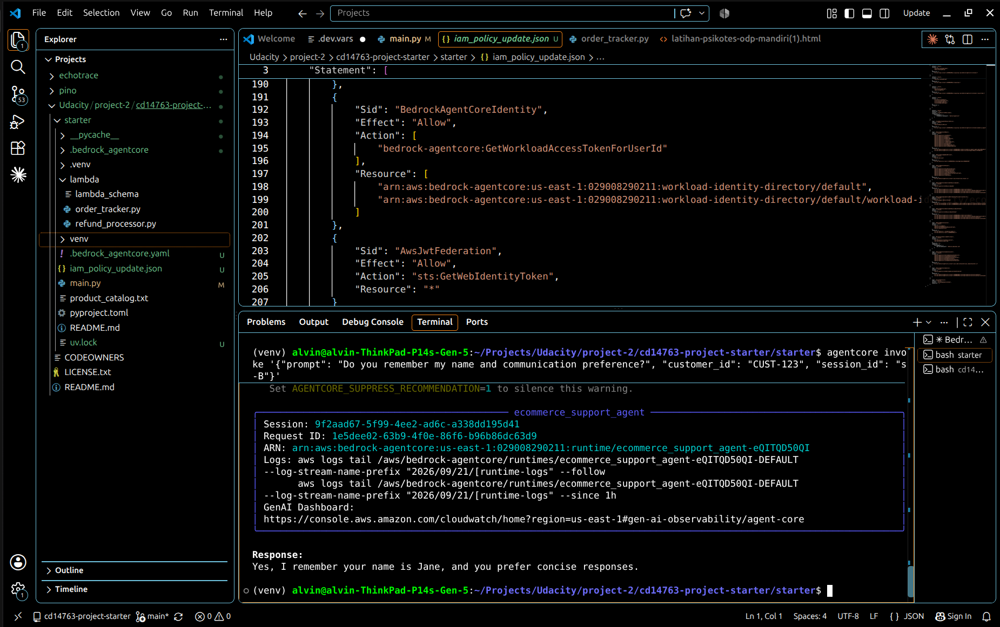
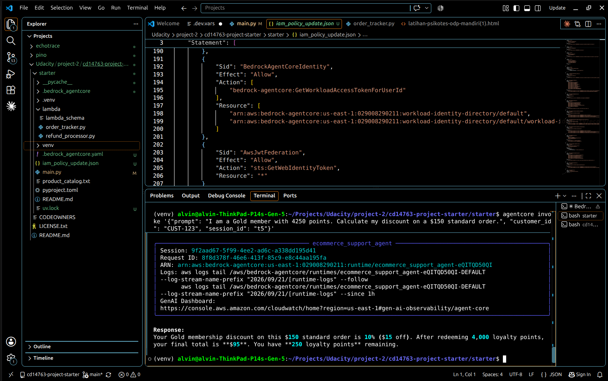
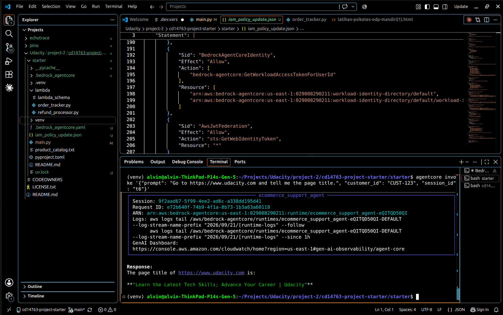

# Project: Building a Production-Grade Customer Support AI Agent with Amazon Bedrock AgentCore

**Udacity — AWS AI Engineering Nanodegree — Course 2**

---

## Overview

A fully functional, production-ready AI customer support agent for a fictional Amazon store, built on **Amazon Bedrock AgentCore**.

The agent can:

- Answer questions about products, return policies, and loyalty rewards using Retrieval-Augmented Generation (RAG)
- Look up order status and process refunds by calling Lambda functions through the AgentCore Gateway
- Remember customer preferences and conversation history across multiple sessions
- Calculate exact loyalty discounts using a secure code sandbox
- Navigate websites to fetch live information

## Architecture

- **Amazon Bedrock AgentCore Runtime** — hosts the agent (`BedrockAgentCoreApp`, deployed via `agentcore deploy`), model: Amazon Nova Lite
- **AgentCore Gateway (MCP)** — exposes two Lambda-backed tools: `order-tracker` (API Gateway proxy) and `refund-processor` (direct Lambda)
- **Amazon Bedrock Knowledge Base** — RAG over the product catalog and support policies
- **AgentCore Memory** — cross-session semantic facts + user preferences, via a custom `MemoryHook`
- **AgentCore Code Interpreter** — sandboxed execution of the loyalty discount calculation
- **AgentCore Browser** — live web page retrieval

---

## Prerequisites

### AWS Account

- An active AWS account with permission to create and manage:
  - IAM roles and policies
  - Lambda functions
  - API Gateway REST APIs
  - Amazon Bedrock Knowledge Bases (with S3 access)
  - Amazon Bedrock AgentCore resources (Runtime, Gateway, Memory)
  - Amazon CloudWatch
- All resources should be created in **us-east-1** (N. Virginia) unless stated otherwise.

### Local Development Environment

| Tool | Version |
|------|---------|
| Python | 3.14+ |
| [uv](https://docs.astral.sh/uv/) | Latest |
| AWS CLI | v2 |
| AgentCore CLI (`agentcore`) | Installed via the starter-toolkit |
| Node.js (for MCP Inspector) | 18+ |

### Model Access

Enable the current Nova Lite generation available in your account under
**Amazon Bedrock console → Model access**. `main.py` pins the exact `model_id`.

---

## Project Structure

```
project/
├── README.md                 ← this file
├── starter/
│   ├── main.py                ← the agent implementation
│   ├── REFLECTION.md          ← written reflection
│   ├── screenshots/           ← test 1-6 evidence
│   └── lambda/
│       ├── order_tracker.py     ← provided; deploy as-is, do not modify
│       └── refund_processor.py  ← provided; deploy as-is, do not modify
└── solution/                 ← reference implementation (do not copy)
```

---

## Part 1 — AWS Infrastructure Setup

Complete these steps **before** writing any agent code.

### Step 1.1 — Project Initialisation

```bash
uv init customer-support-agent
cd customer-support-agent
uv add strands-agents strands-agents-tools
uv add bedrock-agentcore bedrock-agentcore-starter-toolkit
```

### Step 1.2 — Deploy the Lambda Functions

The two Lambda functions (`order_tracker.py` and `refund_processor.py`) are provided in `starter/lambda/`. They are pre-built backend infrastructure — deploy them as-is; the project is about integrating with them, not changing them.

1. In the AWS Lambda console, create two functions (Python 3.12+ runtime): `order-tracker` and `refund-processor`.
2. Paste the contents of each file into the inline code editor (or zip and upload).
3. Attach an execution role with basic Lambda permissions (CloudWatch Logs).
4. Note the ARN of each function.

### Step 1.3 — Set Up the AgentCore Gateway

The Gateway exposes your Lambda functions as MCP tools the agent can call.

1. Open **Amazon Bedrock console → AgentCore → Gateways**.
2. Create a new Gateway named `CustomerSupportGateway`.
3. Add two **Lambda targets**:

   | Target Name | Lambda Function | Integration |
   |---|---|---|
   | `order_tracker` | `order-tracker` | API Gateway REST proxy |
   | `refund_processor` | `refund-processor` | Direct Lambda invocation |

4. For `order_tracker`, configure API Gateway routes:
   - `GET /orders/{order_id}`
   - `GET /customers/{customer_id}/orders`
   - `GET /customers/{customer_id}`
5. For `refund_processor`, import the tool schema from `lambda/lambda_schema`.
6. Copy the **Gateway URL** (ends with `/mcp`) into `GATEWAY_URL` in `main.py`.

In `main.py`, connect to it with a transport factory:

```python
mcp_link = MCPClient(lambda: streamable_http_client(GATEWAY_URL))
gateway_tools = await mcp_link.load_tools()
tools_list.extend(gateway_tools)
```

**Verify with MCP Inspector:**
```bash
npx @modelcontextprotocol/inspector
# Connect to your Gateway URL and confirm all tools are listed.
```

### Step 1.4 — Create the Knowledge Base

1. Upload `product_catalog.txt` to an S3 bucket in your account.
2. In **Bedrock console → Knowledge Bases**, create a new Knowledge Base named `CustomerSupportKB`, using that S3 bucket as the data source.
3. **Sync** the data source.
4. Copy the **Knowledge Base ID** into `KB_ID` in `main.py`.
5. Confirm your account's actual KB list and its type before wiring up the tool:
   ```bash
   aws bedrock-agent list-knowledge-bases --region us-east-1
   aws bedrock-agent get-knowledge-base --knowledge-base-id <id> --region us-east-1
   ```

In `search_knowledge_base`, retrieve with the configuration matching your KB's
type — `managedSearchConfiguration` for a Bedrock-managed knowledge base,
`vectorSearchConfiguration` for a self-managed vector store (e.g. OpenSearch Serverless):

```python
response = _bedrock_runtime.retrieve(
    knowledgeBaseId=KB_ID,
    retrievalQuery={"text": query},
    retrievalConfiguration={"managedSearchConfiguration": {"numberOfResults": 3}}
)
```

**Verify:**
```bash
# Bedrock console → your Knowledge Base → "Test" tab
# Query: "What is the return policy for electronics?"
# Expected: 15-day return window for electronics
```

### Step 1.5 — Create the AgentCore Memory Resource

1. In **Bedrock console → AgentCore → Memory**, create a new Memory resource named `CustomerSupportMemory`.
2. Add two **Memory Strategies**:

   | Strategy | Name | Namespace |
   |---|---|---|
   | Semantic extraction | `customer_facts` | `cs_agent/{actorId}/facts` |
   | User preference | `customer_preferences` | `cs_agent/{actorId}/preferences` |

3. Copy the **Memory ID** into `MEMORY_ID` in `main.py`.

Use the `MemoryClient` SDK's actual response shapes and keyword names:
`get_memory_strategies(memory_id)` and `retrieve_memories(...)` each return a
**list** directly (strategies have `type` + `namespaces`/`namespaceTemplates`;
memory records are shaped `{"content": {"text": "..."}, ...}`), and
`retrieve_memories` takes `memory_id`/`namespace`/`query`/`top_k`.
`create_event()` has no `namespace` parameter:

```python
memory_client.create_event(
    memory_id=..., actor_id=..., session_id=...,
    messages=[(customer_query, "USER"), (agent_response, "ASSISTANT")],
)
```

### Step 1.6 — Scope the Deployed Agent's IAM Execution Role

The execution role `agentcore deploy` creates the first time you deploy
(`AmazonBedrockAgentCoreSDKRuntime-<region>-<suffix>`) only auto-grants logs,
X-Ray, model invocation, whichever memory resource the toolkit itself
created, and Code Interpreter. Extend its inline policy to also cover:

- `bedrock-agentcore:{GetMemory,CreateEvent,RetrieveMemoryRecords,...}` on the exact Memory resource ARN in `MEMORY_ID`
- `bedrock:Retrieve` on the Knowledge Base ARN
- Browser tool session actions — `StartBrowserSession`, `StopBrowserSession`, `GetBrowserSession`, `ListBrowserSessions`, `ConnectBrowserAutomationStream`, `GetBrowser`, `ListBrowsers` — scoped to `browser/aws.browser.v1`

Verify what the deployed agent is actually doing (not just what it looks
like locally, which runs under your own broader credentials):
```bash
aws logs tail /aws/bedrock-agentcore/runtimes/<agent>-DEFAULT --since 1h
```

---

## Part 2 — Building the Agent

Open `starter/main.py` and implement each `# TODO` section in order.

### Section 1 — Configuration and Initialisation

Set up `BedrockAgentCoreApp`, `BedrockModel` (Nova Lite), `MemoryClient`, and the `boto3` Bedrock runtime client, using the resource IDs from Part 1.

### Section 2 — Knowledge Base Tool

Implement `search_knowledge_base(query)` per Step 1.4 above. Include a guard
clause returning a descriptive fallback message when `KB_ID` isn't configured.

**Test:**
```bash
agentcore invoke '{"prompt": "Is the Kindle Paperwhite waterproof?"}'
```

### Section 3 — Long-Term Memory Hook

Implement `MemoryHook(HookProvider)`:
- `retrieve_customer_context` — query all memory namespaces and prepend results to the user message
- `save_support_interaction` — save the completed (user, assistant) turn after each response
- `register_hooks` — register both on `MessageAddedEvent` / `AfterInvocationEvent`

Pass it into the agent via the constructor, not by assigning afterward:
```python
agent = Agent(model=model, tools=tools_list, system_prompt=system_prompt, hooks=[memory_hook])
```

`event.agent.messages` items are plain dicts in Bedrock Converse format —
`{"role": "user"/"assistant", "content": [{"text": "..."}]}` for text, or
`{"toolUse": {...}}` / `{"toolResult": {...}}` for tool calls. Write small
dict-aware helpers to extract text and detect tool-call messages, and use
those inside both hook methods.

### Section 4 — Loyalty Discount Tool (Code Interpreter)

Implement `calculate_loyalty_discount(loyalty_points, tier, order_total, product_category)`:
build a self-contained Python code string encoding the discount rules, run it
in the sandbox, and include a fallback for when the sandbox is unavailable.

```python
with code_session(REGION) as session:
    resp = session.invoke("executeCode", {"code": code, "language": "python", "clearContext": True})
    for event in resp["stream"]:
        structured = event.get("result", {}).get("structuredContent", {})
        stdout_output = structured.get("stdout", stdout_output)
```

**Test:**
```bash
agentcore invoke '{"prompt": "I am a Gold member with 4250 points. Calculate my discount on a $150 order.", "customer_id": "CUST-123", "session_id": "s1"}'
```

### Section 5 — Main Entrypoint

Implement `invoke(payload, context)`: extract `prompt`/`customer_id`/`session_id`,
instantiate `MemoryHook` and `AgentCoreBrowser`, connect to the Gateway,
build the `Agent` with all tools and hooks, and call it asynchronously:

```python
agent_response = await agent.invoke_async(str(enriched_user_input))
```

In the system prompt, instruct the agent to look up an order's real total
(e.g. via a `get_order` tool) before calling `initiate_refund`, and to pass
that as the refund amount — it's an optional field the model won't fill in
correctly unless told to.

### Section 6 — Deploy to AgentCore

Before running locally with `uv run main.py '{...}'`, comment out `app.run()`
and uncomment `main()` at the bottom of `main.py` — then revert that before
deploying, since `agentcore deploy` requires `app.run()` to be active.

```bash
agentcore configure   # first time only
agentcore deploy
agentcore invoke '{"prompt": "Hello, what can you help me with?", "customer_id": "CUST-123", "session_id": "test-1"}'
```

If a tool degrades to its fallback once deployed, check Step 1.6 (IAM) before
assuming it's a code bug.

---

## Part 3 — Functional Testing

### Test 1 — Order Tracking
```bash
agentcore invoke '{"prompt": "Can you track order ORD-001?", "customer_id": "CUST-123", "session_id": "t1"}'
```


### Test 2 — Refund Processing
```bash
agentcore invoke '{"prompt": "I want to return my Kindle Paperwhite (ORD-002). Please initiate a refund.", "customer_id": "CUST-123", "session_id": "t2"}'
```


### Test 3 — Knowledge Base (RAG)
```bash
agentcore invoke '{"prompt": "What are the benefits of the Platinum loyalty tier?", "customer_id": "CUST-123", "session_id": "t3"}'
```


### Test 4 — Memory (Long-Term)
```bash
# Session A
agentcore invoke '{"prompt": "Hi, I am Jane. I prefer concise responses.", "customer_id": "CUST-123", "session_id": "s-A"}'
# Wait ~30-90s for long-term extraction, then Session B (new session, same customer_id)
agentcore invoke '{"prompt": "Do you remember my name and communication preference?", "customer_id": "CUST-123", "session_id": "s-B"}'
```
Session A:


Session B:


### Test 5 — Loyalty Discount Calculation
```bash
agentcore invoke '{"prompt": "I am a Gold member with 4250 points. Calculate my discount on a $150 standard order.", "customer_id": "CUST-123", "session_id": "t5"}'
```


### Test 6 — Browser Tool
```bash
agentcore invoke '{"prompt": "Go to https://www.amazon.com and tell me the page title.", "customer_id": "CUST-123", "session_id": "t6"}'
```


---

## Reflection

See [`starter/REFLECTION.md`](./starter/REFLECTION.md) — 200-400 words
covering a design decision, a challenge encountered, and a production
consideration.

---

## Submission Checklist

- [x] Completed `main.py` with all TODO sections implemented (no `pass` or `None` placeholders remaining)
- [x] Screenshots or terminal output for Test 1 — Order Tracking
- [x] Screenshots or terminal output for Test 2 — Refund Processing
- [x] Screenshots or terminal output for Test 3 — Knowledge Base (RAG)
- [x] Screenshots or terminal output for Test 4 — Long-Term Memory (both sessions)
- [x] Screenshots or terminal output for Test 5 — Loyalty Discount Calculation
- [x] Screenshots or terminal output for Test 6 — Browser Tool
- [x] Written reflection (200–400 words) covering a design decision, a challenge, and a production consideration

---

## Helpful References

- [Amazon Bedrock AgentCore Documentation](https://docs.aws.amazon.com/bedrock/latest/userguide/agentcore.html)
- [Strands Agents Documentation](https://strandsagents.com)
- [MCP Inspector](https://github.com/modelcontextprotocol/inspector)
- [uv Package Manager](https://docs.astral.sh/uv/)
