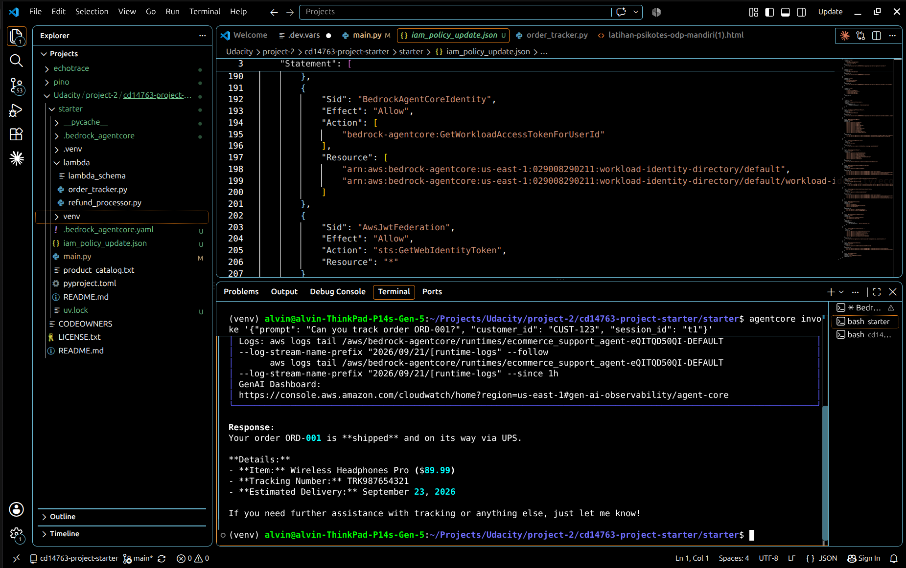
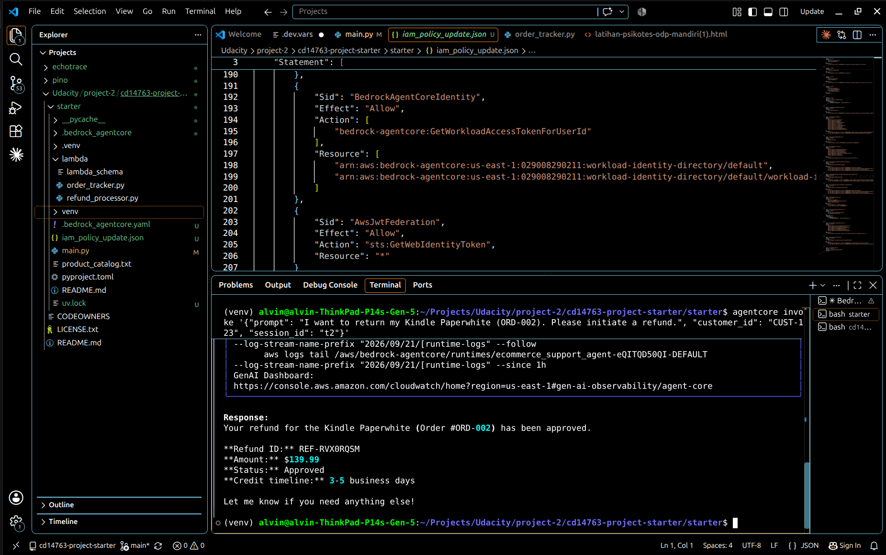
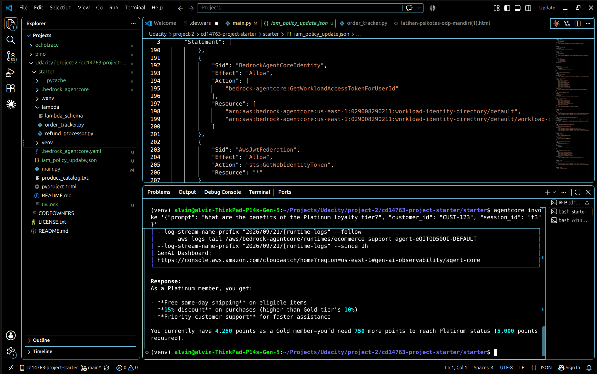
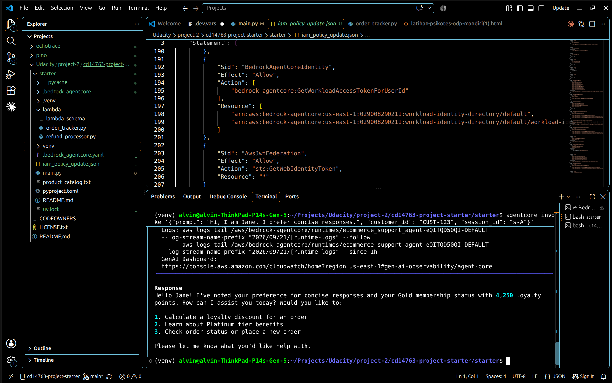
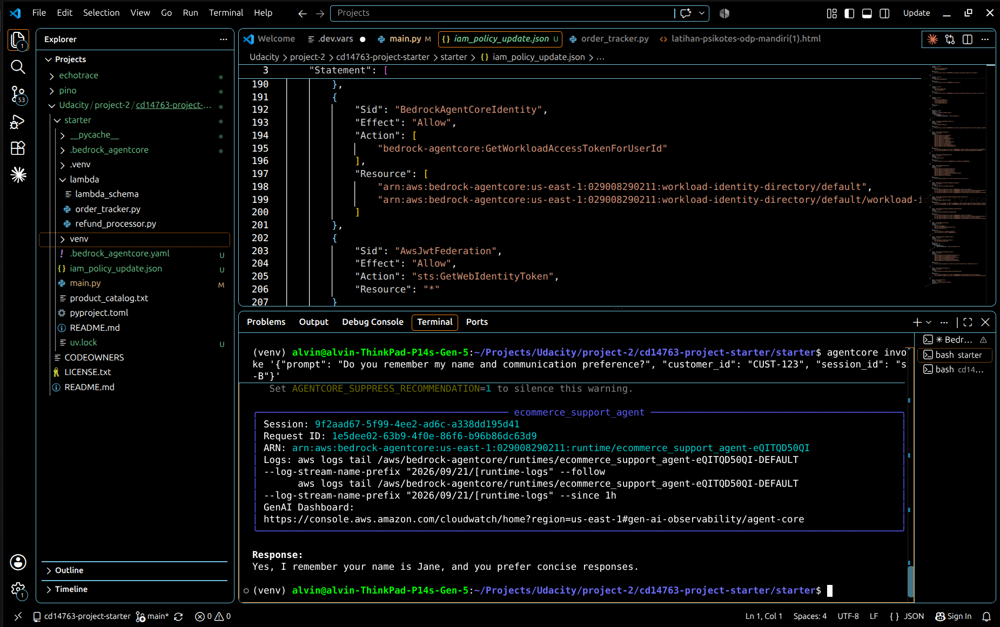
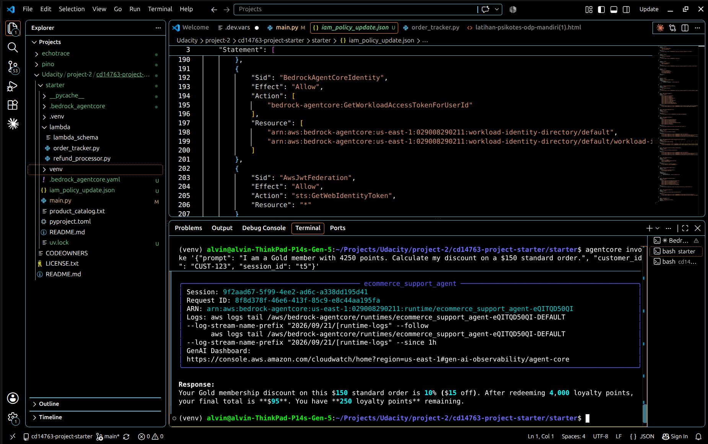
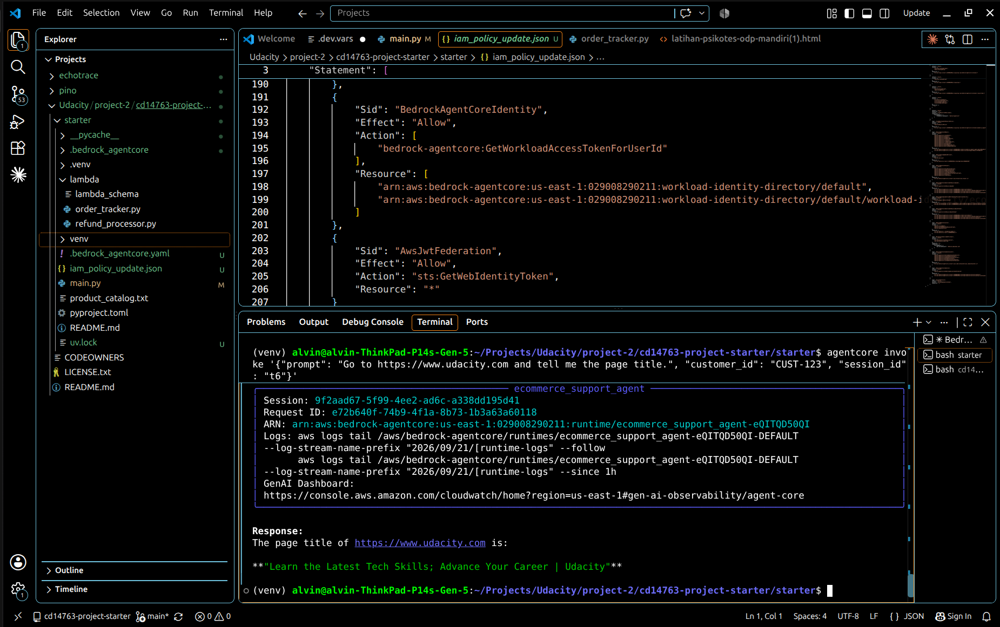

# Project: Production-Grade Customer Support AI Agent with Amazon Bedrock AgentCore

**Udacity — AWS Agentic AI Nanodegree — Course 2 Project**

> **Status:** complete · all 6 functional tests passing on the deployed agent ·
> stand-out extensions · full rebuild guide in [`docs/`](docs/00-overview.md)

## Contents

1. [Overview](#overview)
2. [Architecture](#architecture)
3. [Project Structure](#project-structure)
4. [Quick Start](#quick-start)
5. [Step-by-Step Build](#step-by-step-build)
6. [Testing & Evidence](#testing--evidence)
7. [Stand-out Extensions](#stand-out-extensions)
8. [Rubric Mapping](#rubric-mapping)
9. [Submission Checklist](#submission-checklist)
10. [Study Notes](#study-notes)
11. [Clean Up](#clean-up-after-grading)
12. [References](#references)

---

## Overview

A production-ready AI customer support agent for a fictional Amazon-style store, built
with the **Strands Agents SDK** and deployed on **Amazon Bedrock AgentCore Runtime**.

The agent can:

- answer questions about products, return policies and loyalty rewards with **RAG** over a Bedrock Knowledge Base
- **look up orders and process refunds** through Lambda functions exposed by the **AgentCore Gateway (MCP)**
- **remember customers** (facts and preferences) across sessions with **AgentCore Memory**
- calculate exact **loyalty discounts** in the secure **AgentCore Code Interpreter**
- read **live web pages** with the **AgentCore Browser**

## Architecture

```
Customer ── agentcore invoke ──► AgentCore Runtime (BedrockAgentCoreApp, starter/main.py)
                                   │  Strands Agent · Amazon Nova 2 Lite · hooks=[MemoryHook]
      ┌────────────────┬───────────┼────────────────┬──────────────────┐
      ▼                ▼           ▼                ▼                  ▼
 AgentCore Gateway   Bedrock     AgentCore       AgentCore Code     AgentCore
 (MCP)               Knowledge   Memory          Interpreter        Browser
  ├─ order-tracker   Base (RAG)  facts +         loyalty discount   live web
  │  (API Gateway)   product     preferences     (sandboxed Python) pages
  └─ refund-processor catalog    per customer
     (direct Lambda)
```

| Component | Role |
|---|---|
| **AgentCore Runtime** | Hosts the agent (`BedrockAgentCoreApp`, `@app.entrypoint`), deployed with `agentcore deploy`; model `global.amazon.nova-2-lite-v1:0` |
| **AgentCore Gateway (MCP)** | Two Lambda-backed targets: `order-tracker` (API Gateway proxy) and `refund-processor` (direct Lambda) |
| **Bedrock Knowledge Base** | RAG over `product_catalog.txt` (products, returns, loyalty rules, order statuses) |
| **AgentCore Memory** | Semantic facts + user preferences per customer, via a custom `MemoryHook` |
| **Code Interpreter** | Exact loyalty-discount arithmetic in a sandbox, validated with Pydantic |
| **Browser** | Live web page retrieval |

## Project Structure

```
cs-bedrock-agentcore-chatbot-v2/
├── README.md                       ← this file
├── REFLECTION.md                   ← design decision, challenge, production consideration
├── docs/                           ← step-by-step rebuild guide (00-overview … 10-troubleshooting)
├── screenshots/                    ← test 1–6 evidence
└── starter/
    ├── main.py                     ← ⭐ the agent implementation (all TODOs)
    ├── product_catalog.txt         ← Knowledge Base source document
    ├── lambda/
    │   ├── order_tracker.py        ← provided; deploy as-is
    │   ├── refund_processor.py     ← provided; deploy as-is
    │   └── lambda_schema           ← refund tool schema for the Gateway target
    ├── .bedrock_agentcore.yaml     ← AgentCore deployment record
    ├── pyproject.toml / uv.lock    ← dependencies
```

---

## Quick Start

For someone running it for the first time (full explanation in [`docs/`](docs/00-overview.md)):

```bash
# 0. Tools: Python 3.14+, uv, AWS CLI v2 (us-east-1), Node.js 18+; enable Nova Lite model access
cd starter && uv sync

# 1. Infrastructure (AWS Console)                        → docs/02 … docs/05
#    Lambdas (order-tracker, refund-processor) → Gateway (2 targets)
#    → Knowledge Base on product_catalog.txt → Memory (facts + preferences)
#    Paste GATEWAY_URL, KB_ID, MEMORY_ID into starter/main.py

# 2. Deploy                                              → docs/07
agentcore configure        # first time only
agentcore deploy
#    Extend the runtime role (Memory ARN, bedrock:Retrieve on the KB, browser actions)

# 3. Verify                                              → docs/08
agentcore invoke '{"prompt": "Can you track order ORD-001?", "customer_id": "CUST-123", "session_id": "t1"}'
```

---

## Step-by-Step Build

### Part 1 — Infrastructure (before any agent code)

| Step | What | Notes |
|---|---|---|
| 1.1 | Project initialisation (`uv init`, `uv add strands-agents strands-agents-tools bedrock-agentcore bedrock-agentcore-starter-toolkit`) | [docs/01](docs/01-setup.md) |
| 1.2 | Deploy `order-tracker` and `refund-processor` Lambdas as-is | [docs/02](docs/02-lambda-backends.md) |
| 1.3 | AgentCore Gateway `CustomerSupportGateway`: `order_tracker` (API Gateway proxy, 3 GET routes) + `refund_processor` (direct Lambda, `lambda_schema`); verify with MCP Inspector | [docs/03](docs/03-gateway.md) |
| 1.4 | Knowledge Base `CustomerSupportKB` on `product_catalog.txt`, synced; check the KB **type** (managed vs vector) | [docs/04](docs/04-knowledge-base.md) |
| 1.5 | Memory `CustomerSupportMemory` with `customer_facts` (`cs_agent/{actorId}/facts`) and `customer_preferences` (`cs_agent/{actorId}/preferences`) | [docs/05](docs/05-memory.md) |
| 1.6 | Scope the deployed runtime's IAM role (Memory ARN, `bedrock:Retrieve`, browser session actions) | [docs/07](docs/07-entrypoint-and-deployment.md#iam-scoping-for-the-deployed-agent) |

### Part 2 — Building the Agent (`starter/main.py`)

| Section | Implementation | Notes |
|---|---|---|
| 1 Configuration & initialisation | `BedrockAgentCoreApp`, `BedrockModel` (Nova 2 Lite), `MemoryClient`, `bedrock-agent-runtime` client | [docs/07](docs/07-entrypoint-and-deployment.md) |
| 2 Knowledge Base tool | `search_knowledge_base` with guard clause, `managedSearchConfiguration`, grounded fallback | [docs/04](docs/04-knowledge-base.md) |
| 3 Long-term memory hook | `MemoryHook(HookProvider)`: retrieve context on `MessageAddedEvent`, save the turn on `AfterInvocationEvent`, dict-aware message helpers | [docs/05](docs/05-memory.md) |
| 4 Loyalty discount tool | Code string → `code_session(REGION).invoke("executeCode", {..., "clearContext": True})` → stdout from the event stream → Pydantic validation → fallback | [docs/06](docs/06-code-interpreter-and-browser.md) |
| 5 Entrypoint | `@app.entrypoint async def invoke()`: MemoryHook, `AgentCoreBrowser`, `MCPClient(lambda: streamable_http_client(GATEWAY_URL))`, `Agent(..., hooks=[memory_hook])`, `await agent.invoke_async(...)` | [docs/07](docs/07-entrypoint-and-deployment.md) |
| 6 Deploy | `app.run()` active → `agentcore deploy` (switch to `main()` only for local CLI tests) | [docs/07](docs/07-entrypoint-and-deployment.md) |

---

## Testing & Evidence

All tests run against the **deployed** agent (`agentcore invoke` from `starter/`).
Full commands: [docs/08](docs/08-testing-and-submission.md).

| # | Test | Result |
|---|---|---|
| 1 | Order tracking — `ORD-001` | Shipped via UPS, Wireless Headphones Pro $89.99, tracking TRK987654321, ETA (Gateway → API Gateway → Lambda) |
| 2 | Refund — Kindle Paperwhite `ORD-002` | Approved, `REF-…`, real total $139.99, 3–5 business days (Gateway → Lambda) |
| 3 | Knowledge Base — Platinum tier benefits | Free same-day shipping, 15% discount, priority support |
| 4 | Long-term memory — two sessions, same customer | Session B recalls "Jane" and "concise responses" |
| 5 | Loyalty discount — Gold, 4250 pts, $150 | 10% off, 4000 pts redeemed → **$95.00**, 250 pts left |
| 6 | Browser — udacity.com page title | "Learn the Latest Tech Skills; Advance Your Career \| Udacity" |

### Test 1 — Order Tracking


### Test 2 — Refund Processing


### Test 3 — Knowledge Base (RAG)


### Test 4 — Long-Term Memory
Session A:


Session B:


### Test 5 — Loyalty Discount


### Test 6 — Browser Tool


---

## Stand-out Extensions

| Extension | Where | Value |
|---|---|---|
| **Structured output validation (Pydantic)** | `DiscountOutputSchema`, `starter/main.py:317-321`, validated at `:385-387` | Sandbox output is type-checked before it reaches the model |
| **Conversation summarisation / trimming** | `invoke()`, `starter/main.py:480-487` | Long histories are condensed to protect the token budget |
| **Grounded fallbacks** | `search_knowledge_base` `:290-297`, `calculate_loyalty_discount` `:391-413` | Correct answers from catalog rules when KB/sandbox are blocked |
| **Safe memory-context enrichment** | `invoke()`, `starter/main.py:489-515` | Memories prepended per namespace, each failure isolated |

Details: [docs/09-standout.md](docs/09-standout.md).

---

## Rubric Mapping

Line numbers refer to `starter/main.py`.

### Agent Deployment & Tool Integration

| Criterion | Where |
|---|---|
| `BedrockAgentCoreApp` instance at module level | `:52` |
| Async `invoke` function with `@app.entrypoint` | `:432-433` |
| `app.run()` as main entry point | `:543` |
| Test output: `agentcore invoke` with no errors | any screenshot, e.g. `screenshots/test_1_order_tracking.png` |
| `MCPClient` connects to the Gateway and loads tools | `:458-463` (inside `invoke()`) |
| ≥ 2 distinct Gateway-backed tools invoked, well-formed responses | `test_1_order_tracking.png` (`order-tracker`, API-based) and `test_2_refund_processing.png` (`refund-processor`, Lambda-based) |

### Agent Intelligence

| Criterion | Where |
|---|---|
| `search_knowledge_base` tool: `@tool`, Retrieve, joined chunks, guard clause, docstring | `:261-297` |
| `get_namespaces` fetches strategy types/namespaces | `:106-122` |
| `MemoryHook(HookProvider)` with `register_hooks` | `:169-243` |
| `retrieve_customer_context` — queries namespaces, tags by strategy, prepends to the message | `:180-208` |
| `save_support_interaction` — extracts the last turn, calls `create_event()` | `:210-239` |
| Cross-session recall test (two sessions, same customer ID) | `test_4a_memory_session_A.png` + `test_4b_memory_session_B.png` |
| `calculate_loyalty_discount`: business rules, `code_session(...).invoke("executeCode", ...)` with `clearContext=True`, fallback, structured result | `:317-413` |
| `AgentCoreBrowser` instantiated with region, added to the tools list | `:452`, `:455` |
| Test output: agent retrieves content from a live page | `test_6_browser_tool.png` |

### Code Quality & Reflection

| Criterion | Where |
|---|---|
| Written reflection, 200–400 words: design decision + challenge + production consideration | [`REFLECTION.md`](REFLECTION.md) |

---

## Submission Checklist

- [x] `starter/main.py` — all TODO sections implemented (no `pass` or `None` placeholders)
- [x] Test 1 — Order Tracking
- [x] Test 2 — Refund Processing
- [x] Test 3 — Knowledge Base (RAG)
- [x] Test 4 — Long-Term Memory (both sessions)
- [x] Test 5 — Loyalty Discount Calculation
- [x] Test 6 — Browser Tool
- [x] Written reflection (200–400 words)

## Study Notes

| | |
|---|---|
| [00 Overview](docs/00-overview.md) | [06 Code Interpreter & Browser](docs/06-code-interpreter-and-browser.md) |
| [01 Setup](docs/01-setup.md) | [07 Entrypoint & deployment](docs/07-entrypoint-and-deployment.md) |
| [02 Lambda backends](docs/02-lambda-backends.md) | [08 Testing & submission](docs/08-testing-and-submission.md) |
| [03 Gateway](docs/03-gateway.md) | [09 Stand-out](docs/09-standout.md) |
| [04 Knowledge Base](docs/04-knowledge-base.md) | [10 Troubleshooting](docs/10-troubleshooting.md) |
| [05 Memory](docs/05-memory.md) | |

## Clean Up (after grading)

Delete the AgentCore Runtime (`agentcore destroy`), the Gateway, the Memory, the
Knowledge Base and its S3 bucket, the API Gateway REST API, both Lambda functions and
the runtime role. Details: [docs/08](docs/08-testing-and-submission.md#clean-up-after-grading).

## References

- [Amazon Bedrock AgentCore](https://docs.aws.amazon.com/bedrock-agentcore/latest/devguide/) · [Strands Agents](https://strandsagents.com)
- [MCP Inspector](https://github.com/modelcontextprotocol/inspector) · [uv](https://docs.astral.sh/uv/)
